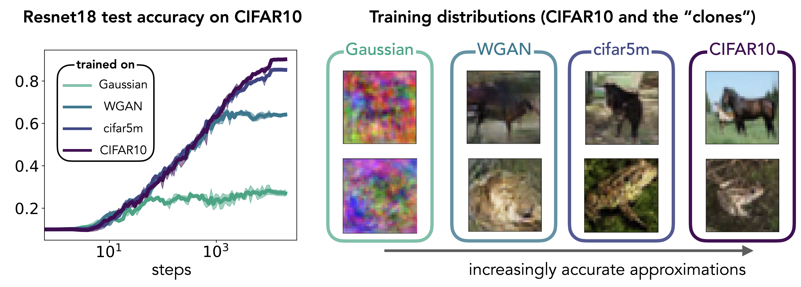

# Learning distributions of increasing complexity

This respository contains code to accompany the paper "Neural networks trained
with SGD learn distributions of increasing complexity"
[arXiv:2211.xxxxx](https://arxiv.org/abs/2211.xxxxx) by M. Refinetti, A. Ingrosso, and
S. Goldt.

# In a nutshell



In this plot, we show the test accuracy of a ResNet18 evaluated on CIFAR10
during training with SGD on four different training data sets: the standard
CIFAR10 training set (dark blue), and three different ``clones'' of the training
set. The images of the clones were drawn from a Gaussian mixture fitted to
CIFAR10, a mixture of Wasserstein GAN (WGAN) fitted to CIFAR10, and the
[cifar5m](https://github.com/preetum/cifar5m) data set of [Nakkiran et
al.](https://openreview.net/forum?id=guetrIHLFGI). The clones form a hierarchy
of approximations to CIFAR10: while the Gaussian mixture captures only the first
two moments of the inputs of each class correctly, the images in the WGAN and
cifar5m data sets yield increasingly realistic images by capturing higher-order
statistics. The ResNet18 trained on the Gaussian mixture has the same test
accuracy on CIFAR10 as the baseline model, trained directly on CIFAR10, for the
first 50 steps of SGD; the ResNet18 trained on cifar5m has the same error as the
baseline model for about 2000 steps. This result suggests that the network
trained on CIFAR10 discriminates the images using increasingly higher-order
statistics during training.

# Usage

The key programme to train the network on distributions of increasing complexity
is ```dist_inc_comp.py```.

# Requirements

To run the code, you will need up-to-date versions of

- pyTorch
- numpy
- scipy
- einops
